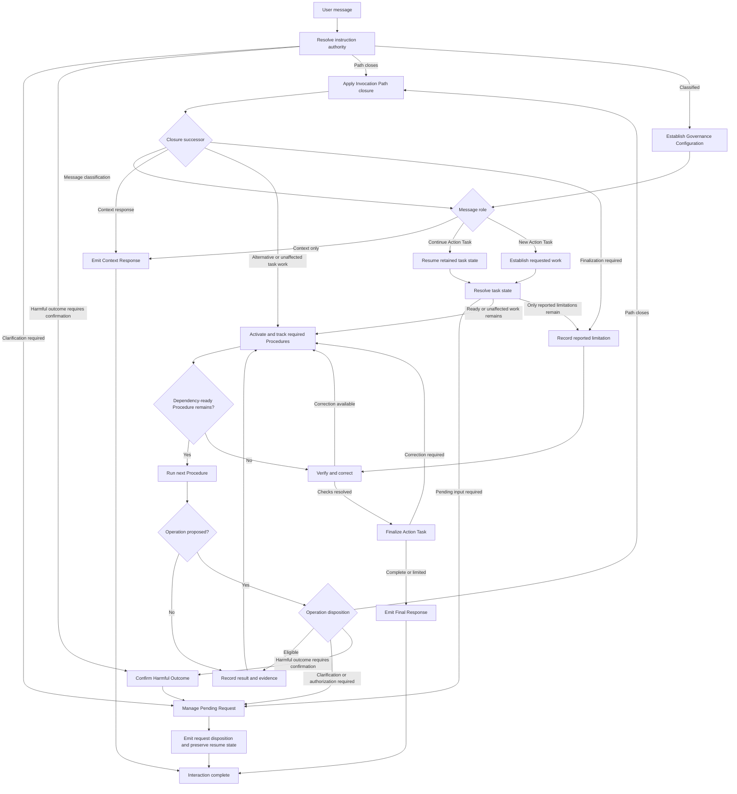

# AI Governance Rules

This directory contains local AI governance rules for AI-assisted work.

The system starts from a problem model: AI systems have recurring failure modes that can produce incorrect, unsafe, incomplete, or inconsistent work.

The governance response is to define reusable Procedures that reduce the impact of those failure modes by making work more explicit, deterministic, verifiable, scoped, and reviewable.

The system is designed for frontier AI models, AI agents, and direct LLM workflows that can read local instruction files.

---

## Model And File Responsibilities

`README.md` is the declarative source for the governance project's objective, problem model, design intent, executive design model, and coverage model.

`AGENTS.md` is the executive implementation of that declarative model.

A declarative requirement is covered when `AGENTS.md` assigns it an executive owner, an observable result, and a disposition for unresolved or failed execution.

The declarative and executive models have complementary responsibilities:

- `README.md` explains why the governance system exists, which failures it addresses, and which properties define its execution model.
- `AGENTS.md` defines the exact terminology, Procedures, classifications, routing, Verification, and final dispositions used during work.

The governance source consists of `README.md` and `AGENTS.md`.

---

## Documentation

- [Tutorial](docs/tutorial.md) explains setup, configuration, interaction behavior, Procedures, safety controls, and practical usage.
- [Acceptance Test Matrix](docs/acceptance-test-matrix.md) defines the behavioral scenarios, expected results, evidence requirements, and evaluation protocol.
- [State Machine](docs/state-machine.md) visualizes interaction states, transitions, terminal outcomes, and dead-branch analysis.
- [Acceptance Test Automation Roadmap](docs/automation-roadmap.md) describes an optional path for converting the manual matrix into independently observed automated tests.

---

## Design Intent

### Principles

1. **Problem-First Procedure Design**: AI failure modes determine the Procedures required to mitigate them.
2. **Declarative And Executive Separation**: Project purpose and design live in `README.md`; operational behavior lives in `AGENTS.md`.
3. **Authority With Extension**: The governance payload remains authoritative while compatible consuming-project instructions extend it.
4. **Structured Ownership**: Terms, Interaction Control, Operation Control, Procedure Routing And State, Task Procedures, Software And Content Procedures, Governing Artifact Procedures, and Verification, Audit And Finalization each have explicit owners.
5. **Meaning Integrity**: Every executive instruction contributes a distinct requirement, decision, or disposition.
6. **Dependency-Ordered Meaning**: Primitive terms, composite terms, gates, and Procedure results precede dependent executive actions.
7. **Single Source Of Truth**: The repository owns the governance source; runtime copies are Generated Deployment Output.
8. **Deterministic Instruction Flow**: Authority resolution, state classification, routing, operation selection, and completion follow bounded decision Procedures.
9. **Evidence Over Assumption**: Material Claims, paths, Runtime Environment state, and Compatibility Claims receive Verification or an explicit unverified or unknown disposition; derived conclusions receive evidence-linked Claim Qualification.
10. **Requested-Scope Discipline**: Requested work and correctness-required dependencies define the work boundary.
11. **Verification Before Completion**: Claims, operations, artifacts, changes, and final responses receive their required verification before completion.
12. **Maintainability By Automation**: Persistent designs remain deterministically regenerable, validatable, and updateable.
13. **Self-Contained Documentation**: `README.md` contains the declarative context required to understand the governance model from repository state.
14. **Observable Interaction Completion**: Every handled user message produces one Final Response, Context Response, or Pending Request disposition; closing one execution branch preserves the remaining interaction.
15. **Bounded Behavioral Evidence**: Evidence for an exact Invocation Context establishes executable behavior at a finite tool boundary while every activated extension remains subject to recursive inspection and executor authorization remains independently classified.
16. **Composable Governance Configuration**: Configured terms receive their values from active Governance Configuration properties established only after authority classification covers the complete available instruction context.

---

## Problem Model

The caveats below are the canonical inventory of failure modes this project aims to mitigate.

They are not mapped one-to-one to individual rules.

They define the problems that the Procedure model responds to.

### Knowledge And Truth

- `Hallucinations`: Generates false information that is presented confidently.
- `Speculation`: Fills gaps by guessing when evidence is missing.
- `Fabricated_sources`: Invents references, citations, APIs, functions, papers, or people.
- `Outdated_knowledge`: May rely on obsolete information unless external data is used.
- `Cannot_distinguish_unknown`: Often predicts the most likely answer instead of explicitly saying "I don't know."

### Reasoning

- `Probabilistic_not_deterministic`: Produces the statistically most likely continuation, not guaranteed facts.
- `Arithmetic_errors`: Can make calculation mistakes without external verification.
- `Logical_inconsistency`: May contradict itself across different parts of the same conversation.
- `Hidden_assumptions`: Introduces assumptions that were never stated.
- `Overgeneralization`: Applies patterns beyond where they are valid.

### Context

- `Limited_context_window`: Cannot consider information that does not fit in the current context.
- `Context_loss`: Earlier information may be forgotten or compressed.
- `Incomplete_input`: Missing user information often leads to incorrect conclusions.
- `Ambiguity_resolution`: Must choose an interpretation when multiple are possible.
- `Order_sensitivity`: Different prompt ordering can produce different answers.

### Software And Code

- `Unverified_code`: Generated code is not executed unless explicitly tested.
- `Invented_APIs`: May use functions, parameters, or libraries that do not exist.
- `Ignores_edge_cases`: Happy-path solutions are more common than robust ones.
- `Partial_refactoring`: May modify only some occurrences, leaving inconsistencies.
- `Version_confusion`: Can mix features from different language or library versions.
- `Opaque_executable_behavior`: Executable implementation details may be unavailable or impractical to inspect recursively, while configuration, scripts, hooks, and plugins activated by an invocation can materially change behavior.

### Documents And Data

- `Fabricated_content`: Can invent missing sections instead of reporting they are unavailable.
- `OCR_errors`: Text extracted from images may contain mistakes.
- `Table_misinterpretation`: Complex tables and layouts are sometimes parsed incorrectly.
- `Unit_confusion`: May mix units or silently convert them incorrectly.

### Planning

- `Invalid_dependencies`: May overlook prerequisite steps.
- `Unrealistic_plans`: Can underestimate effort, time, or constraints.
- `Missing_constraints`: May optimize for unstated objectives instead of actual ones.

### Consistency

- `Non_repeatability`: The same prompt may produce different outputs.
- `Style_drift`: Formatting or terminology may change during long conversations.
- `Definition_drift`: Previously established terminology may not be applied consistently.

### Human Interaction

- `Confidence_bias`: Correct and incorrect statements may be expressed with similar confidence.
- `Confirmation_bias`: May follow the user's assumptions instead of challenging unsupported ones.
- `Suggestibility`: Leading questions can influence conclusions.
- `Social_bias`: Wording may be affected by conversational cues rather than evidence.

### Retrieval

- `Missing_information`: Without access to external sources, cannot know recent events.
- `Source_quality`: Retrieved information may itself be inaccurate or biased.
- `Citation_errors`: May misattribute information or misunderstand cited material.

### Multimodal

- `Image_misinterpretation`: May misunderstand visual details.
- `Diagram_errors`: Can incorrectly infer relationships from charts or diagrams.
- `Audio_transcription_errors`: Speech recognition mistakes propagate into later reasoning.

### Security

- `Prompt_injection`: Can be influenced by malicious instructions embedded in retrieved content.
- `Data_leakage`: Poorly designed workflows around an AI system may expose confidential information.
- `Tool_trust`: Incorrect outputs from external tools may be accepted unless validated.
- `Filesystem_link_introduction`: Direct or indirect file-producing Operations can introduce link artifacts whose resolved targets and publication behavior differ from their apparent Workspace paths.

### Workflow

- `Requires_verification`: Outputs should be checked before use in critical systems.
- `Garbage_in_garbage_out`: Poor prompts usually produce poor answers.
- `Domain_limitations`: Performance varies significantly across domains.
- `Hidden_reasoning`: Internal reasoning is not directly inspectable, making error diagnosis difficult.
- `Automation_bias`: Users may trust AI outputs more than warranted because they appear fluent.

### Long Term Projects

- `Goal_drift`: Long-running work can gradually deviate from the original objective.
- `Accumulated_errors`: Small mistakes compound over multiple iterations.
- `Inconsistent_state`: Different sessions may not share identical context.
- `Specification_erosion`: Requirements can be unintentionally simplified or omitted during revisions.

---

## Executive Design Model

The Executive Design Model defines the properties required for complete, deterministic, and traceable governance behavior.

### Semantic Integrity

Every declarative requirement has an executive coverage definition containing its objective, Dependencies, authorization behavior, owner, observable result, dispositions, and acceptance scenario.

Requirements with identical operational meaning share one executive guarantee. Other sections reference that guarantee through its authoritative term or action-oriented section name.

The executive implementation is `Evaluate Governing Artifact Quality`, especially `Establish The Guarantee Record`.

### Executive Action Contract

An executive responsibility is complete when it establishes:

- a Trigger;
- required inputs;
- an ordered Procedure;
- exhaustive classifications or dispositions;
- a named result;
- Verification where correctness depends on observable evidence.

The executive implementation is shared by the action-oriented Procedures in `AGENTS.md` and evaluated by `Apply Quality Criteria`.

### Positive Execution

Restrictions are represented through admission criteria, classifications, state transitions, and required dispositions. This design specifies the action to perform when a condition succeeds, fails, remains uncertain, requires authorization, or reaches a permanent constraint.

The executive implementation appears in information statuses, claim statuses, instruction-authority statuses, operation eligibility statuses, quality results, audit findings, and final task dispositions.

### Definition Topology

Primitive terms precede composite terms. Composite terms precede the Procedures that consume them. Derived states are established by their owning Procedure before later Procedures reference them.

The executive implementation begins with `Terms` and is enforced by the dependency-order criterion in `Evaluate Governing Artifact Quality`.

### Bounded Behavioral Inspection

An Invocation Context identifies the exact proposed invocation, including each executor or tool identity and version, entry command, arguments, working directory, behavior-relevant environment, manifests, configuration, defaults, and discovered project state. Executable inspection is complete when Evidence Items establish a Behavioral Contract for that context and its classification-relevant inputs, outputs, effects, and Behavior Extensions. This creates an Established Tool Boundary at which implementation-recursion ends.

Recursion continues through every Behavior Extension activated by the Invocation Context. Runtime schemas and contracts, authoritative exact-version documentation, runtime command metadata, inspected definitions, and independently Eligible isolated observations can contribute evidence.

Behavioral sufficiency establishes the Operation Footprint. Executor authorization remains a separate eligibility decision for every Direct Executor and Indirect Executor.

The executive implementation is `Inspect Executable Behavior`, with classification and authorization owned by `Evaluate Operation Eligibility`.

### Single Ownership And References

Every definition and guarantee has one authoritative executive owner. Other sections use the established term or reference the owning Procedure.

Unique, action-oriented section names provide stable and unambiguous reference targets. Repetition appears only when it adds a distinct Trigger, decision, result, or Verification responsibility.

The executive implementation is the ownership and distinctness criteria in `Evaluate Governing Artifact Quality`, with compaction performed by `Review Documents`, `Optimize Rules`, and `Review Rules`.

### Disposition Completeness

Missing information, ambiguity, assumptions, conflicting evidence, failed tools, unavailable Verification, user-input requirements, harmful-outcome confirmation, permanent constraints, and incomplete work each produce an explicit next state and action.

An excluded, blocked, indeterminate, or denied instruction or Operation closes only its affected Invocation Path. Remaining message classification or executable Task work continues when available. An affected action request otherwise proceeds through verification, finalization, and a reported limitation, while a context-only interaction proceeds to a Context Response.

The executive implementation is distributed across `Manage A Pending Request`, `Confirm A Harmful Outcome`, `Resolve Information`, `Qualify Claims`, `Close An Invocation Path`, `Resolve Instruction Authority`, `Evaluate Operation Eligibility`, `Verify Work`, and `Finalize Task`.

### Interaction Completion

Each user message reaches exactly one observable Interaction Disposition. `Manage A Pending Request` emits each required clarification, authorization, or confirmation request, retains its originating Procedure state, classifies later responses through instruction authority, and either resumes or closes that origin according to explicit response conditions. `Confirm A Harmful Outcome` supplies the shared confirmation conditions. Completed Action Tasks emit a Final Response after finalization. Context-only interactions emit a Context Response.

Procedure activation and completion remain separately traceable through one compact Procedure Execution Record for each invocation. A stable Task-scoped identifier, ordered status history, Trigger reference, outcome reference, and evidence references preserve the lifecycle. Detailed task artifacts retain work content, and private reasoning remains outside the lifecycle record.

Active records, terminal records required by finalization, and the outcome and evidence referents required to interpret them survive Pending Requests, continuation messages, and context compression. Every required record reaches `completed` or `limited` before task completion.

The executive implementation is `Manage A Pending Request`, `Confirm A Harmful Outcome`, `Complete The Interaction`, and `Track Procedure Execution`, supported by `Close An Invocation Path` and `Finalize Task`.

### Traceable Coverage

A declarative requirement is considered covered when:

- an executive section owns it;
- the executive section produces an observable result;
- dependencies appear before use;
- unresolved and failure states have dispositions;
- representative acceptance scenarios demonstrate the intended behavior;
- final verification can detect an incomplete implementation.

The executive implementation is the Guarantee Record, Change Surface review, quality result, `Review Rules`, `Audit Instructions`, and `Finalize Task`.

---

## Interaction At A Glance

Every user message enters one root Procedure. Authority resolution covers every available Candidate Instruction before Governance Configuration establishes configured terms. The message then becomes a context response, continuation of an existing Action Task, or new Action Task. Action work proceeds through information resolution, Procedure activation, Operation eligibility, execution, Verification, finalization, and one observable response.



Four transitions govern exceptional cases:

1. `Manage A Pending Request` emits the required clarification, authorization, or confirmation request after unaffected Eligible work and preserves the exact state resumed by a later response.
2. `Confirm A Harmful Outcome` records a matching confirmed scope or closes the unconfirmed path after refusal, zero required effects, or repeated Confirmation required classification.
3. Closing an Invocation Path ends only the affected branch. Eligible alternatives and unaffected work continue; otherwise the affected requested item becomes a reported limitation.
4. Each handled user message emits exactly one Final Response, Context Response, or Pending Request disposition.

Configuration establishment begins only after all available Candidate Instructions have authority classifications. It collects active properties from the complete instruction context, resolves configured terms according to their combination rules, and retains a missing or ambiguous required property as unresolved until dependent work requires its resolution.

`Execute A User Interaction` owns this orchestration. The referenced Procedures own the detailed classifications, actions, evidence, and dispositions.

---

## Procedure Model

The Procedures reduce the probability and impact of the canonical failure modes. Their purpose is mitigation, detection, correction, and explicit reporting rather than a claim of complete elimination.

The model organizes executive actions as Trigger-activated Procedures with ordered actions and defined results or dispositions. The Active Procedure Set accumulates Procedures activated directly, explicitly requested, selected by routing, or invoked by another active Procedure.

`Execute A User Interaction` is the single orchestration owner. It sequences the applicable phases while each referenced Procedure retains ownership of its classifications, actions, evidence, and dispositions.

The executive model progresses through these layers, which correspond to the grouped executive structure:

1. **Terms** establish primitive, information, task, authority, artifact, and operation concepts.
2. **Interaction Control** sequences every user interaction; manages Pending Requests and harmful-outcome confirmation; resolves information, Claims, approaches, Invocation Path closure, and instruction authority; establishes Governance Configuration and Requested Work; and completes each interaction.
3. **Operation Control** establishes the Workspace, classifies Operation eligibility and executable behavior, selects tools, verifies compatibility and work, corrects errors, and selects maintainable Artifacts and repository script languages.
4. **Procedure Routing And State** produces the Task Specification, activates required Procedures from one routing owner, and records each Procedure lifecycle.
5. **Task Procedures** govern reasoning, research, and planning.
6. **Software And Content Procedures** govern implementation, code review, editing, document creation, and document review.
7. **Governing Artifact Procedures** evaluate quality and author, optimize, and review Governing Artifacts through Guarantee Records, Check Results, and Acceptance Scenarios.
8. **Verification, Audit And Finalization** verifies Facts, audits instruction compliance, and returns finalization results for observable interaction completion.

The model distinguishes Action Tasks from contextual messages so task analysis and finalization are activated by requests that require an action or defined result.

The primary executive results are:

- an information disposition;
- a claim status;
- the Active Instruction Set;
- Governance Configuration and its configured terms;
- the Requested Scope and Task Specification;
- a Pending Request lifecycle result and harmful-outcome confirmation result;
- an Operation eligibility decision;
- the Active Procedure Set;
- an Invocation Path closure result;
- Procedure Execution Records;
- meaning-integrity and Guarantee Records;
- Verification, Check Result, governing-artifact quality, audit, and task-completion results;
- exactly one Interaction Disposition for each handled user message.

---

## Repository And Runtime Layout

This repository is the authoritative source for the governance model.

`README.md` stores its declarative model.

`AGENTS.md` stores executive Procedures, Governance Configuration, or both according to its placement and role.

Generated or copied runtime layouts are Generated Deployment Output from this Source of Truth.

The exact term definitions, classifications, Procedures, report formats, and Authority Guard belong to executive `AGENTS.md` content. Configurable values belong under `Governance Configuration` and may be supplied by a configuration-only `AGENTS.md` whose content becomes part of the complete loaded instruction context.

One ancestor `AGENTS.md` can provide shared executive governance for multiple workspaces, while each workspace supplies a configuration-only `AGENTS.md` for its own needs:

```text
governance-root/
  AGENTS.md                    shared executive governance and Authority Guard
  workspaces/
    workspace-a/
      AGENTS.md                Governance Configuration for workspace A
    workspace-b/
      AGENTS.md                Governance Configuration for workspace B
```

Selecting `workspace-a` as the working directory assembles the shared executive governance with workspace A's configuration. Workspace B's configuration is outside that ancestor chain and does not participate; selecting `workspace-b` assembles the same governance with workspace B's configuration instead.

---

## Executive Coverage

The table identifies the executive owner and result for each cross-cutting declarative responsibility.

| Declarative responsibility | Executive owner | Executive result |
| --- | --- | --- |
| Interaction orchestration | `Execute A User Interaction` | Every user message follows an ordered path through authority, configuration establishment, requested-work classification, task establishment, Procedure activation, execution, Verification, finalization, and interaction completion. |
| Governance configuration | `Resolve Instruction Authority`, `Establish Governance Configuration` | After every available Candidate Instruction receives an authority classification, active configuration properties establish configured terms before requested-work handling; missing or ambiguous required properties remain unresolved until dependent use. |
| Pending user input | `Manage A Pending Request` | Clarification, authorization, and confirmation requests share one retained-state lifecycle with explicit success, terminal-response, and unresolved outcomes. |
| Harmful-outcome confirmation | `Confirm A Harmful Outcome` | A predicted Harmful Outcome receives one scoped confirmation protocol and either a Confirmed Harmful Outcome or Invocation Path closure. |
| Information integrity | `Resolve Information` | Each Information Item receives an admissible, recoverable, clarification-required, interpretation-set, assumption-eligible, or unresolved disposition before it contributes to the Task Specification. |
| Claim integrity | `Qualify Claims`, `Verify Facts` | Each Claim receives a presentation status connected to evidence and verification. |
| Deterministic selection | `Select An Approach` | Competing approaches receive an ordered comparison. |
| Instruction authority | `Resolve Instruction Authority` | Candidate Instructions produce the Active Instruction Set. |
| Invocation-path continuity | `Close An Invocation Path` | Affected paths receive recorded closure and limitation dispositions while unaffected or eligible alternative work continues. |
| Requested work and context | `Establish Requested Work`, `Analyze Task` | Requested Scope, Task Specification, and readiness status are established. |
| Workspace and execution safety | `Establish The Workspace`, `Evaluate Operation Eligibility`, `Inspect Executable Behavior`, `Verify Work` | Operations receive Permanent block, Indeterminate, Eligible alternative, Authorization required, Confirmation required, or Eligible dispositions. Invocation Context evidence establishes finite tool boundaries, activated Behavior Extensions remain recursively inspected, file-producing Operations receive prospective output-object classification, Workspace Link Introductions receive a Permanent block, and resulting object types receive Verification before dependent use or publication. |
| Tools and compatibility | `Inspect Executable Behavior`, `Select Tools And Operations`, `Verify Runtime Compatibility` | Sufficient Behavioral Evidence establishes a Behavioral Contract for an Invocation Context; Current Authorization independently determines executor authorization; Tool Results become evidence; and Compatibility Claims receive verified or unverified status. |
| Verification and correction | `Verify Work`, `Correct Earlier Output`, `Verify Facts` | Detected issues receive correction, repeated verification, or an unresolved classification. |
| Maintainability | `Select Maintainable Artifacts`, `Select Repository Script Language` | Persistent designs and repository scripts receive deterministic selection outcomes. |
| Task-specific work | `Analyze Task`, `Route Task Procedures`, `Track Procedure Execution`, and activated task Procedures | Direct Triggers, explicit user requests, routing decisions, and Procedure invocations produce the cumulative Active Procedure Set and compact per-invocation lifecycle records that survive retained and compressed Task state. |
| Meaning integrity | `Edit Content`, `Review Documents`, `Evaluate Governing Artifact Quality` | Meaning and Guarantee Records distinguish required content from authorized modifications. |
| Governance quality | `Evaluate Governing Artifact Quality`, `Author Rules`, `Optimize Rules`, `Review Rules` | Shared Check Results produce correction-required, verification-required, passed, conforming, accepted, or acceptance-withheld outcomes while preserving Guarantee Record coverage. |
| Compliance review | `Audit Instructions` | Evidence produces confirmed violations, risks, and unverified items, followed by a violations-found, inconclusive, or pass result. |
| Completion | `Finalize Task`, `Manage A Pending Request`, `Complete The Interaction` | The Work Product receives a completion disposition and every handled user message emits exactly one observable Interaction Disposition while retained requests preserve their resume state. |

### Routed Procedures

`Analyze Task` and `Finalize Task` activate directly for every Action Task. `Route Task Procedures` connects Task Specification characteristics to these additional executive Procedures, and later Trigger changes extend the Active Procedure Set:

| Executive Procedure | Declarative responsibility |
| --- | --- |
| `Reason From Evidence` | Connect conclusions to Facts, Assumptions, and explicit Dependencies. |
| `Research Sources` | Gather and compare evidence by Source authority and Evidence Strength. |
| `Plan Work` | Produce executable steps, Dependencies, Risks, and Completion Criteria. |
| `Select Tools And Operations` | Validate and invoke the eligible tool or Operation required for correctness. |
| `Implement Code` | Produce verified software changes within Requested Scope. |
| `Review Code` | Compact completed code while maintaining behavior and verification. |
| `Edit Content` | Apply requested modifications through a meaning-integrity record. |
| `Create Documents` | Produce structured documents with consistent terms, references, and Canonical Content. |
| `Review Documents` | Compact document meaning through authoritative references and semantic-integrity checks. |
| `Author Rules` | Create executive Governing Artifacts under the quality model. |
| `Optimize Rules` | Improve Governing Artifacts through Guarantee Records and bounded change. |
| `Review Rules` | Validate Governing Artifacts against quality, dependency, compatibility, and meaning-integrity criteria. |
| `Verify Facts` | Verify Material Claims and factual Claims involving changing information, sources, compatibility, paths, Runtime Environment state, names, identifiers, versions, dates, numbers, units, and references. |
| `Audit Instructions` | Compare completed or proposed work with the Active Instruction Set. |

---

## Loading Model

The loading model originates in Pi Agent's native context-file behavior and is separate from the executive content of `AGENTS.md`.

The intended runtime flow is:

1. Determine the repository root and working directory.
2. Read the applicable `AGENTS.md` files from the repository root down to the working directory.
3. Treat the complete resulting instruction context as Candidate Instructions and task material according to their established roles.
4. Apply `Execute A User Interaction` to each user message; it resolves authority across every available Candidate Instruction, establishes Governance Configuration from active properties, and then delegates requested-work handling, task establishment, Procedure routing, execution, Verification, finalization, and response emission to their owning Procedures.

An executive `AGENTS.md` does not treat Governance Configuration as absent while only its own fragment is being considered. Configuration absence is evaluated after the complete instruction context has been loaded and authority-classified. This permits one ancestor `AGENTS.md` to provide shared executive content while separate workspace descendants provide configuration-only `AGENTS.md` files; the selected working directory determines which descendant configuration joins the shared governance.

### Pi Agent

Pi Agent natively loads and layers applicable `AGENTS.md` context files from parent directories and the current working directory.

Read the official documentation for its authoritative context-file loading behavior:

- [Pi documentation: Context Files](https://pi.dev/docs/latest/usage)

### Other Frontier AI Agents

For a frontier AI agent or hosted AI interface that does not natively provide Pi Agent's loading behavior, place this adaptation in its user preferences:

```md
Read in order the `AGENTS.md` files found from the repository root (the highest ancestor containing `.git`) down to the working directory.
```

---

## Design Commitments And Executive Owners

The detailed Procedures remain centralized in `AGENTS.md`. The declarative commitments below explain the intended behavior and identify its executive owner.

| Declarative commitment | Executive owner |
| --- | --- |
| Every user message enters one root Procedure that sequences the applicable executive phases and successors. | `Execute A User Interaction` |
| Pi Agent supplies the layered AGENTS context mechanism natively; other frontier AI agents reproduce the repository-to-working-directory behavior through the stated user-preference instruction. | Loading Model |
| Every available Candidate Instruction receives an authority classification before active Governance Configuration properties establish configured terms and requested-work handling begins. | `Resolve Instruction Authority`, `Establish Governance Configuration`, `Execute A User Interaction` |
| Executive Procedures and Governance Configuration may occupy separate applicable `AGENTS.md` files because configuration establishment consumes the complete active instruction context rather than an executive fragment in isolation. | `Establish Governance Configuration`, `Evaluate Governing Artifact Quality` |
| Every clarification, authorization, or confirmation request records its question or scope, boundaries, origin, resume classification, and response conditions; dependent work pauses while unaffected Eligible work continues. | `Manage A Pending Request` |
| Every plausible causal path to an unconfirmed Harmful Outcome uses one confirmation protocol that records matching scope, repeats classification after confirmation, and closes the path after refusal, zero required effects, or repeated Confirmation required status. | `Confirm A Harmful Outcome` |
| Missing, incomplete, ambiguous, and uncertain information receives an explicit disposition before dependent reasoning. | `Resolve Information` |
| Information admissibility depends on the Active Instruction Set and Requested Work, so admissible inputs precede construction of the Task Specification. | `Resolve Information`, `Analyze Task` |
| Facts, Inferences, Assumptions, Opinions, Recommendations, and unverified Claims remain distinguishable. | `Qualify Claims` |
| Material Claims and factual Claims involving changing information, sources, compatibility, paths, Runtime Environment state, names, identifiers, versions, dates, numbers, units, and references receive authoritative Verification or an explicit unverified disposition. | `Verify Facts`, `Verify Runtime Compatibility` |
| User-provided paths remain authoritative inputs, and path discovery is an explicit task capability. | `Resolve Information` |
| Runtime Environment facts originate from runtime tools. | `Select Tools And Operations` |
| Terms, boundaries, permissions, conditions, and gates precede dependent actions. | `Terms`, `Evaluate Governing Artifact Quality` |
| Excluded, blocked, indeterminate, and denied paths receive a recorded closure, affected-item allocation, and successor through remaining classification, context response, Task work, or finalization. | `Close An Invocation Path` |
| Workspace safety applies to the complete Operation Footprint, including indirect execution and Side Effects. | `Evaluate Operation Eligibility`, `Inspect Executable Behavior` |
| Sufficient Behavioral Evidence establishes a Behavioral Contract for the exact Invocation Context and closes implementation-recursion at an Established Tool Boundary. | `Inspect Executable Behavior` |
| Recursive behavioral inspection follows every Behavior Extension activated by the Invocation Context. | `Inspect Executable Behavior` |
| Behavioral sufficiency supplies footprint evidence while executor authorization remains independently required for every Direct Executor and Indirect Executor. | `Inspect Executable Behavior`, `Evaluate Operation Eligibility` |
| Before an Operation introduces filesystem objects inside the Workspace, direct and indirect producers receive output-object-type inspection; a Workspace Link Introduction receives a Permanent block and unresolved output type receives an Indeterminate disposition. | `Evaluate Operation Eligibility`, `Inspect Executable Behavior` |
| Existing Filesystem Link Artifacts trigger effect-aware canonical boundary Verification for Operations that target, traverse, or remove them, while unrelated Operations retain classification from their own Operation Footprints. | `Establish The Workspace`, `Evaluate Operation Eligibility` |
| Filesystem objects introduced by an Eligible Operation receive post-execution object-type Verification before dependent use, packaging, or publication. | `Verify Work` |
| Executor identity and authorization are evaluated recursively against Approved Executor Identities established by Governance Configuration, with a distinct Runtime-controlled Temporary Location disposition. | `Establish Governance Configuration`, `Evaluate Operation Eligibility` |
| Operations use the smallest eligible footprint and request narrowly scoped authorization when expansion is required. | `Select An Approach`, `Evaluate Operation Eligibility` |
| Scoped User Authorization expands Current Authorization for its stated targets and effects, while Permanent Constraints remain unchanged. | `Evaluate Operation Eligibility` |
| Explicit confirmation records a task-bound Confirmed Harmful Outcome and prevents repeated confirmation for the matching action and effects. | `Confirm A Harmful Outcome` |
| Remote network contact is evaluated through its local Operation Targets and Side Effects. | `Evaluate Operation Eligibility` |
| Direct or indirect filesystem reading, enumeration, traversal, discovery, creation, modification, renaming, movement, deletion, execution, or production of Protected Filesystem Artifacts receives Permanent block disposition; a Dedicated Manager Operation is classified independently and is exempt only for the managed effect established by its Behavioral Contract. | `Establish Governance Configuration`, `Establish The Workspace`, `Evaluate Operation Eligibility` |
| Workspace-specific information receives a functional, purpose-bound disclosure decision. | `Establish The Workspace` |
| A Workspace persists across continuation messages for the same Action Task and carries over from a prior Task only through explicit user instruction. | `Establish Requested Work`, `Establish The Workspace` |
| Requested work and correctness-required information define response content. | `Establish Requested Work`, `Finalize Task` |
| Procedure descriptions provide deterministic routing and retain decision-critical Trigger scope. | `Route Task Procedures`, `Evaluate Governing Artifact Quality` |
| Every Procedure activated directly, explicitly requested, selected by routing, or invoked by another active Procedure enters the cumulative Active Procedure Set. | `Terms`, `Route Task Procedures` |
| Every active Procedure invocation has one compact, stable Task-scoped record containing its ordered active, running, completed, limited, or failed transitions and references to its Trigger, outcome, and supporting evidence. | `Track Procedure Execution` |
| Active lifecycle records, terminal records required by finalization, and their required outcome and evidence referents persist across Pending Requests, continuation messages, and context compression. | `Track Procedure Execution`, `Finalize Task` |
| Governing Artifacts include prompts, policies, standards, schemas, specifications, routing rules, examples, checklists, and references. | `Terms`, `Author Rules`, `Optimize Rules`, `Review Rules` |
| Quality criteria and Acceptance Scenarios share pass, failure-with-exact-mismatch, and unverified-with-missing-evidence Check Results before governing-artifact acceptance. | `Evaluate Governing Artifact Quality`, `Review Rules` |
| Coding and documentation workflows include dedicated post-work semantic-integrity reviews. | `Implement Code`, `Review Code`, `Create Documents`, `Review Documents` |
| Grammatical structure keeps relationships among actions, objects, and qualifiers unambiguous. | `Evaluate Governing Artifact Quality` |
| The Preferred Workspace Script Language established by Governance Configuration is selected when project conventions and stronger constraints establish no other eligible language. | `Establish Governance Configuration`, `Select Repository Script Language` |
| Persistent designs use deterministic regeneration, validation, and update processes; copied runtime layouts remain Generated Deployment Output. | `Select Maintainable Artifacts` |
| Compatible extensions maintain instruction authority; an executive Governing Artifact ends its executive content with the task-independent Authority Guard, while a Governance Configuration section, when present, is the final non-executive section. | `Resolve Instruction Authority`, `Evaluate Governing Artifact Quality` |
| Completed work remains auditable against its Active Instruction Set, Requested Scope, evidence, and required Procedures. | `Audit Instructions`, `Finalize Task` |
| Every handled user message emits exactly one Final Response, Context Response, or Pending Request disposition; retained waits name the state resumed by a later response. | `Manage A Pending Request`, `Complete The Interaction` |
| Audit results are violations found when evidence confirms a violation, inconclusive when material evidence remains unavailable, and pass when remaining uncertainty has an isolated effect on the result. | `Audit Instructions` |

---

## Failure-Mode Coverage Orientation

The canonical failure modes are mitigated compositionally. A direct Procedure supplies the primary decision path for a failure; compositional coverage results from several shared executive Procedures acting together.

| Failure-mode family | Primary executive coverage | Coverage form |
| --- | --- | --- |
| Knowledge and truth | `Resolve Information`, `Qualify Claims`, `Research Sources`, `Verify Facts`, `Finalize Task` | Direct |
| Reasoning | `Select An Approach`, `Analyze Task`, `Reason From Evidence`, `Verify Facts` | Direct |
| Context | `Manage A Pending Request`, `Resolve Information`, `Establish Requested Work`, `Analyze Task`, `Complete The Interaction`, `Finalize Task` | Direct |
| Software and code | `Inspect Executable Behavior`, `Select Tools And Operations`, `Verify Runtime Compatibility`, `Implement Code`, `Review Code`, `Verify Work` | Direct |
| Documents and data | `Resolve Information`, `Edit Content`, `Create Documents`, `Review Documents`, `Verify Facts` | Direct |
| Planning | `Analyze Task`, `Plan Work`, `Evaluate Operation Eligibility` | Direct |
| Consistency | `Terms`, `Qualify Claims`, `Edit Content`, `Review Documents`, `Evaluate Governing Artifact Quality`, `Finalize Task` | Compositional |
| Human interaction | `Manage A Pending Request`, `Confirm A Harmful Outcome`, `Resolve Information`, `Qualify Claims`, `Resolve Instruction Authority`, `Reason From Evidence` | Compositional |
| Retrieval | `Research Sources`, `Qualify Claims`, `Select Tools And Operations`, `Verify Facts` | Direct |
| Multimodal | `Resolve Information`, `Qualify Claims`, `Select Tools And Operations`, `Create Documents`, `Verify Facts` | Compositional |
| Security | `Confirm A Harmful Outcome`, `Resolve Instruction Authority`, `Close An Invocation Path`, `Establish The Workspace`, `Evaluate Operation Eligibility`, `Inspect Executable Behavior`, `Select Tools And Operations` | Compositional |
| Workflow | `Manage A Pending Request`, `Analyze Task`, `Plan Work`, `Track Procedure Execution`, `Verify Work`, `Finalize Task`, `Complete The Interaction` | Compositional |
| Long-term projects | `Manage A Pending Request`, `Resolve Information`, `Establish Requested Work`, `Track Procedure Execution`, `Edit Content`, `Review Documents`, `Review Rules`, `Finalize Task`, `Complete The Interaction` | Compositional |
| Cross-cutting instruction compliance | `Audit Instructions` | Direct |

The executive requirements remain in `AGENTS.md`.
